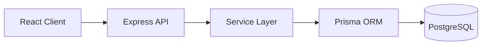
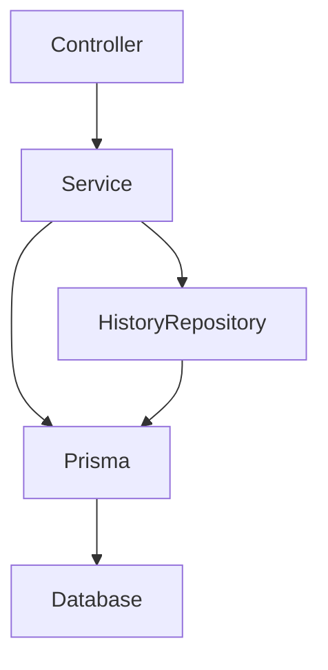

# 1. Overview

Issue Trackerは、チーム開発におけるIssue管理を想定したREST APIです。
単純なCRUD APIではなく、実際の業務システムで求められる認証・認可・監査・履歴管理・論理削除・状態遷移制御を考慮して設計・実装しました。
API設計ではDTOとMapperによるAPI契約の分離、RBACによる認可、Refresh Token Rotationによる認証、履歴管理による監査性など、保守性・拡張性・セキュリティを重視しています。

## Design Principles

本プロジェクトでは以下の方針で設計しています。

- DTOによるAPI契約固定
- MapperによるEntity分離
- Repositoryによる履歴データ参照処理の分離
- Role Based Access Control
- Soft Delete
- History Table
- Refresh Token Rotation
- Transactionによる整合性維持

# 2. Features

## Authentication

- JWT Access Token認証
- Refresh Token Rotation
- Refresh TokenのHash保存
- 失効済みRefresh Token再利用検知
- HttpOnly CookieによるRefresh Token管理

## Authorization

- RBAC(Role Based Access Control)
- User Roleによる権限制御
- Project Roleによるプロジェクト単位の権限制御

Project Role:

| Role    | Permission                             |
| ------- | -------------------------------------- |
| OWNER   | プロジェクトの最高権限。複数人設定可能 |
| MANAGER | メンバー管理・Issue管理が可能          |
| MEMBER  | Issue作成・更新・コメント可能          |
| VIEWER  | 閲覧のみ                               |

## Project Management

- Project CRUD
- Project Member管理
- Member Role変更
- Project単位アクセス制御

## Issue Management

- Issue CRUD
- Issue Status管理
- Status Transition制御
- Priority管理
- Assignee管理

## Comment Management

- Comment CRUD

## Audit / History

- User、Project、Issue、Comment変更履歴の記録・参照
- 更新前後データ(JSON)保持
- DTO/Mapperによる公開用データ変換
- 内部値とAPI公開値を分離

## Data Management

- Pagination
- Soft Delete
- Restore
- Include Query
- Validation

### Deleted Data Management

削除済みデータの取得・復元APIは実装済みです。
フロントエンドの削除済みデータ管理画面は、初期リリースの対応範囲に含めていません。

# 3. Tech Stack

## Backend

| Technology     | Purpose            |
| -------------- | ------------------ |
| TypeScript     | Type Safety        |
| Node.js        | Runtime            |
| Express        | REST API Framework |
| Prisma         | ORM                |
| PostgreSQL     | Database           |
| Zod            | Validation         |
| JWT            | Authentication     |
| Docker         | Container Runtime  |
| Docker Compose | Local Development  |

## Frontend

| Technology | Purpose     |
| ---------- | ----------- |
| React      | UI          |
| TypeScript | Type Safety |

## Development Tools

| Tool           | Purpose           |
| -------------- | ----------------- |
| Postman        | API Testing       |
| Docker Compose | Local Environment |
| Git            | Version Control   |

# 4. Architecture

## System Architecture



## Backend Layer



責務分離:

- Controller
  - HTTP Request / Response管理

- Service
  - Business Logic
  - Transaction制御
  - Prismaを利用したEntity操作
  - Entity変更時のHistory Record作成制御
  - History Repositoryを利用した履歴参照

- Repository
  - 履歴データの参照処理を担当
  - 履歴一覧取得
  - Pagination用件数取得
  - 履歴表示変換用Master取得
  - Prisma QueryをService層から分離
  - 読み取り専用のQuery Repositoryとして実装

- Mapper
  - EntityからDTOへの変換

# 5. Authentication / Authorization

## JWT Authentication

Access TokenとRefresh Tokenを分離しています。

### Access Token

- API Authorization Headerで送信
- 短期間有効
- Client Memoryで保持
- XSSリスクを考慮しLocalStorageには保存しない

### Refresh Token

- HttpOnly Cookie保存
- DBにはHash化して保存
- Token Rotation採用

## Refresh Token Rotation

Refresh Token更新時:

1. 既存Tokenを失効
2. 新しいRefresh Token発行
3. Token Chainを保存

不正利用対策:

- Token Chainを利用してRefresh Tokenの世代管理を行っています。
- 失効済みRefresh Tokenの再利用を検知した場合は、そのユーザーが保持する有効なRefresh Tokenをすべて失効させ、トークン盗難による不正利用を防止します。

## Authorization

RBACを採用しています。

User Role:

- ADMIN
- USER

Project Role:

- OWNER
- MANAGER
- MEMBER
- VIEWER

ユーザー権限だけではなく、プロジェクト単位でアクセス制御を行っています。

# 6. Database Design


## Database

- PostgreSQL

## ORM

- Prisma

## Major Entities

- User
- UserRole
- Project
- ProjectMember
- Issue
- Comment
- ProjectHistory
- HistoryAction
- UserHistory
- IssueHistory
- CommentHistory
- RefreshToken

設計方針:

- Role管理をMaster Table化
- Project Memberによるアクセス制御
- History Tableによる監査情報保持
- Refresh TokenをDB管理
- Soft Deleteによるデータ保持

Database Designでは以下を重視しました。

- Master Tableによるコード値管理
- Soft Deleteによるデータ保持
- History Tableによる監査性
- 正規化を基本としたテーブル設計
- FK制約による整合性維持

※ api_logsは将来的な運用監視機能向けに設計のみ実施しています。
※ History Tableは業務データ変更監査用途、api_logsはシステムアクセス監視用途として役割を分離しています。

# 7. Security

- Password Hashing（bcrypt）
- JWT Authentication
- Refresh Token Rotation
- HttpOnly Cookie
- RBAC
- Input Validation(Zod)
- SQL Injection Prevention(Prisma)
- Refresh Token Hash Storage
- Token Reuse Detection
- Soft Delete Data Protection
- Transaction Integrity Control

# 8. Directory Structure

```text
src
├── config
├── constants
├── controllers
├── dto
│ ├── auth
│ ├── comment
│ ├── common
│ ├── history
│ ├── issue
│ ├── project
│ └── user
├── lib
├── mappers
│ ├── auth
│ ├── comment
│ ├── history
│ ├── issue
│ ├── project
│ └── user
├── middlewares
├── repositories
├── routes
├── selects
├── services
│ └── builders
├── types
├── utils
└── validators
```

Layer責務:

- controllers
  - HTTP Request / Response

- services
  - Business Logic

- repositories
  - History Query Abstraction
  - History Repository
    - 履歴参照処理を担当
    - 履歴一覧取得
    - Pagination用件数取得
    - 表示変換用Master取得
  - Database Access Layer
  - History関連データ取得処理

- mappers
  - Entity / DTO Conversion

- validators
  - Request Validation

# 9. API Design

REST APIとして設計しています。

Base URL:

```
/api/v1
```

主なAPI:

| Resource  | Description              |
| --------- | ------------------------ |
| Auth      | Login / Refresh / Logout |
| Users     | User Management          |
| Projects  | Project Management       |
| Issues    | Issue Management         |
| Comments  | Comment Management       |
| Histories | History Management       |

設計方針:

- DTOによるResponse Contract管理
- MapperによるResponse整形
- ZodによるRequest Validation
- 共通Error Response
- Pagination対応

API設計では以下を重視しました。

- RESTful API
- DTOによるAPI契約固定
- MapperによるEntity分離
- 共通レスポンス形式
- エラーコード統一
- Pagination
- Include Queryによる関連データ取得
- Soft Delete対応

※ History APIはIssue Historyを中心にPhase1で実装しています。

# 10. Testing

## API Testing

Tool:

- Postman

Test Coverage:

Postman Collection:
Issue Tracker Collection
│
├ 00 Setup
│ ├ Reset DB
│ └ Get Access Token
│
├ 01 Auth
│ ├ Login
│ ├ Refresh
│ ├ Me
│ └ Logout
│
├ 02 Projects
│ ├ Create
│ ├ List
│ ├ Detail
│ └ Detail (includeDeleted)
│
├ 03 Issues
│ ├ Create
│ ├ Update Success
│ ├ Update Invalid Transition
│ ├ Delete
│ ├ Restore
│ ├ Detail
│ ├ Detail (include)
│ ├ Prepare Closed Issue
│ │ ├ Move To REVIEW
│ │ ├ Move To DONE
│ │ └ Move To CLOSED
│ └ Update Closed Issue
│
└ 04 Histories
└ Issue History

## Tested Scenarios

- ✅ Authentication
- ✅ Authorization
- ✅ CRUD
- ✅ Validation
- ✅ Status Transition
- ✅ Soft Delete
- ✅ Restore
- ✅ History Recording
- ✅ Refresh Token Rotation
- ✅ Include Query
- ✅ Pagination

### テスト実行前

アプリケーション側でDBを初期化します。

```bash
npm run db:refresh
```

テストでは正常系だけではなく、

権限エラー
不正状態遷移
論理削除状態
Token更新

など業務システムで発生するケースを確認しています。

# 11. Environment Setup

## Requirements

- Node.js v22 LTS
- Docker
- Docker Compose

## Development Environment

- TypeScript strict modeによる型安全性確保
- ESLintによる静的解析
- Prettierによるコードフォーマット統一
- Docker Composeによる開発環境構築

## Setup

### 1. Clone repository

```bash
git clone https://github.com/pawmi555/Issue_tracker
```

### 2. Create environment file

Copy `.env.example` to `.env`.

### 3. Update environment variables

Edit `.env` and set the required values.

### 4. Start Docker

```bash

cd Issue_tracker

docker compose -f docker/docker-compose.dev.yml up -d

docker compose -f docker/docker-compose.dev.yml exec app npm install

docker compose -f docker/docker-compose.dev.yml exec app npm run migrate:dev

docker compose -f docker/docker-compose.dev.yml exec app npm run db:seed

```

# 12. Future Improvements

## Phase2

- API Request Log API
- Admin Dashboard
- Operation Monitoring

## Additional

- Automated Test
- CI/CD Pipeline
- Notification Feature
- Real-time Update(WebSocket)

# 13. Author

GitHub: https://github.com/pawmi555
Portfolio: https://github.com/pawmi555/Issue_tracker
