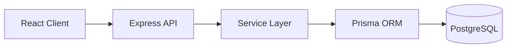
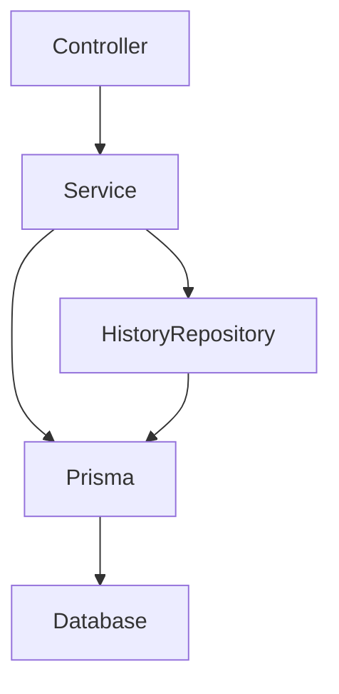
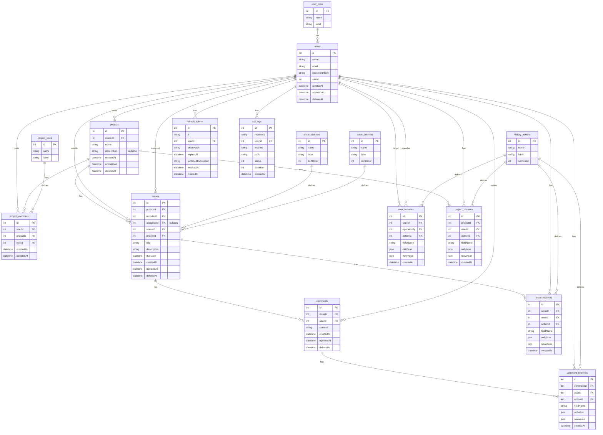

# 1. Overview

Issue Trackerは、チーム開発におけるIssue管理を想定したWebアプリケーションです。

本プロジェクトは、バックエンドエンジニアへの転職を目的として作成したポートフォリオです。

認証・認可、業務ルール、トランザクション、論理削除、変更履歴、状態遷移など、実際の業務システムで必要となるバックエンド設計を中心に実装しています。

API設計では、DTOとMapperによるAPI契約の分離、RBACによる認可、Refresh Token Rotationによる認証、履歴管理による監査性など、保守性・拡張性・セキュリティを重視しています。

## Design Principles

本プロジェクトでは以下の方針で設計しています。

- DTOによるAPI契約固定
- MapperによるEntity分離
- Repositoryによる履歴データ参照処理の分離
- Role Based Access Control
- Soft Delete
- History Table
- Refresh Token Rotation
- Transactionによる整合性維持

# 2. Features

## Authentication

- JWT Access Token認証
- Refresh Token Rotation
- Refresh TokenのHash保存
- 失効済みRefresh Token再利用検知
- HttpOnly CookieによるRefresh Token管理

## Authorization

- RBAC (Role Based Access Control)
- User Roleによる権限制御
- Project Roleによるプロジェクト単位の権限制御

Project Role:

| Role    | Permission                                                                               |
| ------- | ---------------------------------------------------------------------------------------- |
| OWNER   | プロジェクトの最高権限。複数人設定可能                                                   |
| MANAGER | 許可された範囲のメンバー追加・ロール変更、Issue管理が可能。メンバー削除とOWNER操作は不可 |
| MEMBER  | Issue作成・更新・コメント可能                                                            |
| VIEWER  | 閲覧のみ                                                                                 |

## Project Management

- Project CRUD
- Project Member管理
- Member Role変更
- Project単位アクセス制御

### Project作成者とOWNER

- `ownerId`はProjectを最初に作成したユーザーを表します
- `ownerId`はProject作成後に変更しません
- Project内の操作権限は、ProjectMemberに設定されたProjectRoleによって判定します
- ProjectRoleのOWNERは複数人設定できます
- `ownerId`のユーザーとProjectRoleがOWNERのユーザーは、必ずしも一致しません

## Issue Management

- Issue CRUD
- Issue Status管理
- Status Transition制御
- Priority管理
- Assignee管理

## Comment Management

- Comment CRUD

## Audit / History

- User、Project、Issue、Comment変更履歴の記録・参照
- 更新前後データ(JSON)保持
- DTO/Mapperによる公開用データ変換
- 内部値とAPI公開値を分離

## Data Management

- Pagination
- Soft Delete
- Restore
- Include Query
- Validation

### Deleted Data Management

削除済みデータの取得・復元APIは実装済みです。
フロントエンドの削除済みデータ管理画面は、初期リリースの対応範囲に含めていません。

Project一覧では、`includeDeleted`の指定に応じて次のように取得対象を制御します。

- `includeDeleted=false`または未指定の場合、所属する未削除Projectのみ取得します
- `includeDeleted=true`の場合、所属する未削除Projectに加えて、MANAGERまたはOWNERとして所属する削除済みProjectを取得します
- 削除済みProjectにMEMBERまたはVIEWERとして所属している場合、そのProjectは一覧に含まれません
- システムロールがADMINでも、ProjectRoleによる認可をスキップしません

削除済みIssue・Commentの取得、および削除済みIssueの復元は、対象ProjectのMANAGER以上に制限しています。

フロントエンドには削除済みデータ管理画面を実装していないため、削除済みデータの取得・復元はPostmanから確認できます。

削除済みデータを取得する場合は、対象APIに`includeDeleted=true`を指定します。利用には各リソースで定められた権限が必要です。

詳細な対象APIと権限制御は[API設計書](./docs/api-design.md)を参照してください。

# 3. Tech Stack

## Backend

| Technology         | Purpose            |
| ------------------ | ------------------ |
| TypeScript         | Type Safety        |
| Node.js            | Runtime            |
| Express            | REST API Framework |
| Prisma             | ORM                |
| PostgreSQL         | Database           |
| Zod                | Validation         |
| JWT                | Authentication     |
| Docker             | Container Runtime  |
| Docker Compose     | Local Development  |
| bcrypt             | Password Hashing   |
| Helmet             | Security Headers   |
| express-rate-limit | Rate Limiting      |

## Frontend

| Technology      | Purpose                  |
| --------------- | ------------------------ |
| React           | UI構築                   |
| TypeScript      | 型安全性                 |
| Vite            | 開発サーバー・ビルド     |
| React Router    | ルーティング             |
| TanStack Query  | サーバー状態管理         |
| Axios           | HTTP通信                 |
| React Hook Form | フォーム管理             |
| Zod             | 入力バリデーション       |
| MUI             | UIコンポーネント         |
| Zustand         | クライアント状態管理     |
| Nginx           | 本番相当環境での静的配信 |

## Development Tools

| Tool           | Purpose                      |
| -------------- | ---------------------------- |
| Postman        | API Collection・テスト作成   |
| Newman         | Postman CollectionのCLI実行  |
| Docker Compose | ローカル・本番相当環境の構築 |
| Git            | バージョン管理               |

# 4. Architecture

## System Architecture



## Backend Layer



責務分離:

- Controller
  - HTTP Request / Response管理

- Service
  - Business Logic
  - Transaction制御
  - Prismaを利用したEntity操作
  - Entity変更時のHistory Record作成制御
  - History Repositoryを利用した履歴参照

- Repository
  - 履歴データの参照処理を担当
  - 履歴一覧取得
  - Pagination用件数取得
  - 履歴表示変換用Master取得
  - Prisma QueryをService層から分離
  - 読み取り専用のQuery Repositoryとして実装

- Mapper
  - EntityからDTOへの変換

# 5. Authentication / Authorization

## JWT Authentication

Access TokenとRefresh Tokenを分離しています。

### Access Token

- API Authorization Headerで送信
- 短期間有効
- Client Memoryで保持
- XSSリスクを考慮しLocalStorageには保存しない

### Refresh Token

- HttpOnly Cookie保存
- DBにはHash化して保存
- Token Rotation採用

## Refresh Token Rotation

Refresh Token更新時:

1. 既存Tokenを失効
2. 新しいRefresh Token発行
3. Token Chainを保存

不正利用対策:

- Token Chainを利用してRefresh Tokenの世代管理を行っています。
- 失効済みRefresh Tokenの再利用を検知した場合は、そのユーザーが保持する有効なRefresh Tokenをすべて失効させ、トークン盗難による不正利用を防止します。

## Authorization

RBACを採用しています。

User Role:

- ADMIN
- USER

Project Role:

- OWNER
- MANAGER
- MEMBER
- VIEWER

ユーザー権限だけではなく、プロジェクト単位でアクセス制御を行っています。

### ADMINとProject権限

システムロールがADMINであっても、Project内の操作には対象Projectへの所属が必要です。

Project内の実際の操作権限は、ProjectMemberに設定されたProjectRoleによって判定します。

ADMINはProjectRoleによる認可をスキップしません。

# 6. Database Design



## Database

- PostgreSQL

## ORM

- Prisma

## Major Entities

- User
- UserRole
- Project
- ProjectMember
- Issue
- Comment
- ProjectHistory
- HistoryAction
- UserHistory
- IssueHistory
- CommentHistory
- RefreshToken

設計方針:

- Role管理をMaster Table化
- Project Memberによるアクセス制御
- History Tableによる監査情報保持
- Refresh TokenをDB管理
- Soft Deleteによるデータ保持

Database Designでは以下を重視しました。

- Master Tableによるコード値管理
- Soft Deleteによるデータ保持
- History Tableによる監査性
- 正規化を基本としたテーブル設計
- FK制約による整合性維持

※ api_logsは将来的な運用監視機能向けに設計のみ実施しています。
※ History Tableは業務データ変更監査用途、api_logsはシステムアクセス監視用途として役割を分離しています。

# 7. Security

- Password Hashing (bcrypt)
- JWT Authentication
- Refresh Token Rotation
- HttpOnly Cookie
- RBAC
- Input Validation (Zod)
- SQL Injection Prevention (Prisma)
- Refresh Token Hash Storage
- Token Reuse Detection
- Soft Delete Data Protection
- Transaction Integrity Control

# 8. Directory Structure

```text
Issue_tracker
├── app
│   ├── prisma
│   │   ├── migrations
│   │   ├── seed
│   │   ├── schema.prisma
│   │   └── seed.ts
│   └── src
│       ├── config
│       ├── constants
│       ├── controllers
│       ├── dto
│       │   ├── auth
│       │   ├── comment
│       │   ├── common
│       │   ├── history
│       │   ├── issue
│       │   ├── project
│       │   └── user
│       ├── lib
│       ├── mappers
│       │   ├── auth
│       │   ├── comment
│       │   ├── history
│       │   ├── issue
│       │   ├── project
│       │   └── user
│       ├── middlewares
│       ├── repositories
│       ├── routes
│       ├── selects
│       ├── services
│       │   └── builders
│       ├── types
│       ├── utils
│       └── validators
├── frontend
│   └── src
│       ├── api
│       ├── assets
│       ├── components
│       ├── features
│       ├── layouts
│       ├── pages
│       ├── providers
│       ├── routes
│       ├── stores
│       ├── theme
│       ├── types
│       └── utils
├── docker
│   ├── docker-compose.dev.yml
│   └── docker-compose.prod.yml
├── docs
│   ├── api-design.md
│   ├── er-diagram.mmd
│   ├── postman-automated-test-results.md
│   └── postman-regression-test-results.md
├── postman
│   └── Issue-Tracker.postman_collection.json
└── README.md
```

## Main directory responsibilities

### Backend

- `prisma`
  - Prisma Schema、Migration、Seedを管理する
- `controllers`
  - HTTPリクエストを受け取り、Serviceを呼び出してレスポンスを返す
- `services`
  - 業務ロジックとトランザクションを管理する
- `repositories`
  - 履歴データなどの参照処理を分離する
- `validators`
  - Zodによってリクエストを検証する
- `dto`
  - APIレスポンスの契約を定義する
- `mappers`
  - Prismaから取得したデータをDTOへ変換する
- `middlewares`
  - 認証、認可、バリデーション、エラー処理を担当する
- `selects`
  - Prismaで取得するフィールドを定義する

### Frontend

- `api`
  - Axiosの共通設定など、API通信の基盤を管理する
- `assets`
  - 画像などの静的ファイルを管理する
- `components`
  - 複数の画面や機能で使用する共通コンポーネントを管理する
- `features`
  - Auth、Project、Issue、Comment、Historyなどの機能単位で実装を管理する
- `layouts`
  - 画面共通のレイアウトを管理する
- `pages`
  - ルート単位のページコンポーネントを管理する
- `providers`
  - 認証、TanStack Query、MUI ThemeのProviderを管理する
- `routes`
  - ルーティングと保護ルートを管理する
- `stores`
  - Zustandによるクライアント状態を管理する
- `theme`
  - MUIのテーマ設定を管理する
- `types`
  - APIレスポンスなどの共通型を管理する
- `utils`
  - エラー変換などの共通処理を管理する

### Other

- `docker`
  - 開発環境と本番相当環境のDocker Compose設定を管理する
- `docs`
  - API設計書、ER図およびテスト実施結果を管理する
- `postman`
  - APIテストと回帰テストに使用するPostman Collectionを管理する

# 9. API Design

REST APIとして設計しています。

Base URL:

```
/api/v1
```

主なAPI:

| Resource  | Description              |
| --------- | ------------------------ |
| Auth      | Login / Refresh / Logout |
| Users     | User Management          |
| Projects  | Project Management       |
| Issues    | Issue Management         |
| Comments  | Comment Management       |
| Histories | History Management       |

設計方針:

- DTOによるResponse Contract管理
- MapperによるResponse整形
- ZodによるRequest Validation
- 共通Error Response
- Pagination対応

API設計では以下を重視しました。

- RESTful API
- DTOによるAPI契約固定
- MapperによるEntity分離
- 共通レスポンス形式
- エラーコード統一
- Pagination
- Include Queryによる関連データ取得
- Soft Delete対応

※ History APIはIssue Historyを中心にPhase1で実装しています。

# 10. Testing

## 10.1 Test structure

Tool:

- Postman

Postman Collection:

```text
Issue Tracker Collection
│
├ 00 Setup
│ ├ Get Access Token
│ └ Get Deleted Project ID
│
├ 01 Auth
│ ├ Login
│ ├ Refresh
│ ├ Me
│ └ Logout
│
├ 02 Projects
│ ├ Create
│ ├ List
│ ├ Detail
│ └ Detail (includeDeleted)
│
├ 03 Issues
│ ├ 01_Standard Issue Flow
│ │ ├ Create
│ │ ├ Update Success
│ │ ├ Update Invalid Transition
│ │ ├ Delete
│ │ ├ Restore
│ │ ├ Detail
│ │ └ Detail (include)
│ │
│ └ 02_Closed Issue Flow
│   ├ Move To REVIEW
│   ├ Move To DONE
│   ├ Move To CLOSED
│   └ Update Closed Issue
│
├ 04 Histories
│ └ Issue History
│
├ 05 Regression
└ 06 Deleted User Middleware Regression
```

## 10.2 Tested scenarios

以下のPostmanテストを実施し、すべて期待結果と一致することを確認しています。

### テスト対象

- ログイン・ログアウト・トークン更新
- Project、Issue、CommentのCRUD
- ProjectRoleに基づく認可
- Issueの状態遷移
- バリデーション
- 論理削除・復元
- 変更履歴
- Refresh APIによるAccess Token再発行
- 削除済みUserに対する認証ミドルウェアの回帰テスト

### API Tests

- ✅ Authentication
- ✅ Authorization
- ✅ CRUD
- ✅ Validation
- ✅ Status Transition
- ✅ Soft Delete
- ✅ Restore
- ✅ History Recording
- ✅ Refresh APIによるAccess Token再発行
- ✅ Include Query
- ✅ Pagination

### Regression Tests

- ✅ `05 Regression`
- ✅ `06 Deleted User Middleware Regression`

## 10.3 Test results

Postmanを使用して、APIテストおよび回帰テストを実施しています。テストでは正常系だけではなく、次のような業務システムで発生するケースを確認しています。

- 権限エラー
- 不正な状態遷移
- 論理削除状態
- Token更新

### 公開ファイル

- [Postman Collection](./postman/Issue-Tracker.postman_collection.json)
- [自動テスト実施結果](./docs/postman-automated-test-results.md)
- [手動回帰テスト実施結果](./docs/postman-regression-test-results.md)

`00_Setup`から`04_Histories`および`06_Deleted User Middleware Regression`は、Post-response Scriptによる自動判定を実施しています。

`05_Regression`には一部Post-response Scriptが設定されていますが、本ポートフォリオでは29件を手動回帰テストとして実施しています。このフォルダはNewmanによる自動テスト結果34件には含めていません。

手動テストでは、レスポンス、変更履歴およびDB更新結果を確認しています。

## 10.4 How to run

### Collection Variables

Collectionをインポート後、次のCollection Variablesを設定してください。

| Variable   | 設定例                         | 説明                 |
| ---------- | ------------------------------ | -------------------- |
| `baseUrl`  | `http://localhost:3000/api/v1` | 開発環境のAPI URL    |
| `email`    | `admin@example.com`            | 開発用Seedユーザー   |
| `password` | `password123`                  | 開発用Seedパスワード |

Access Tokenやテスト中に生成されるIDは、Post-response Scriptによって自動設定されます。

記載している認証情報はローカル検証用のSeedデータです。本番環境では使用していません。

### テスト実行前

Postmanテストで使用する開発DBを初期化し、開発用Seedデータを登録します。

```powershell
docker compose -f docker/docker-compose.dev.yml exec app npm run db:fresh
```

このコマンドは開発DBのデータを削除して再作成します。必要なデータが残っていないことを確認してから実行してください。

テスト結果の一時出力先を作成します。

```powershell
New-Item -ItemType Directory -Force -Path .\postman\results
```

### Newmanによる自動テスト

```powershell
npx newman@6.2.2 run `
  .\postman\Issue-Tracker.postman_collection.json `
  --folder "00_Setup" `
  --folder "01_Auth" `
  --folder "02_Projects" `
  --folder "03_Issues" `
  --folder "04_Histories" `
  --folder "06_Deleted User Middleware Regression" `
  --env-var "baseUrl=http://localhost:3000/api/v1" `
  --env-var "email=admin@example.com" `
  --env-var "password=password123" `
  --reporters "cli,json" `
  --reporter-json-export ".\postman\results\automated-test-results.json"
```

実行結果で、リクエスト、Test Script、Pre-request Script、Assertionの`failed`がすべて`0`であることを確認します。

### テスト実行後

`06_Deleted User Middleware Regression`では、確認用Userを論理削除します。

ほかの動作確認へ影響しないように、テスト完了後は開発DBをSeed状態へ戻してください。

```powershell
docker compose -f docker/docker-compose.dev.yml exec app npm run db:fresh
```

Newmanが生成する生のJSONレポートにはAccess TokenやCookieなどの認証情報が含まれるため、Gitの管理対象から除外しています。

# 11. Environment Setup

## Requirements

- Node.js v22 LTS
- Docker
- Docker Compose
- Git

## Development Environment

- TypeScript strict modeによる型安全性確保
- ESLintによる静的解析
- Prettierによるコードフォーマット統一
- Docker Composeによる開発環境構築

### 1. Clone repository

```bash
git clone https://github.com/pawmi555/Issue_tracker.git
cd Issue_tracker
```

### 2. Create environment files

バックエンドとフロントエンドの環境変数ファイルを作成します。

#### PowerShell

```powershell
Copy-Item app/.env.example app/.env
Copy-Item frontend/.env.example frontend/.env
```

#### macOS / Linux / Git Bash

```bash
cp app/.env.example app/.env
cp frontend/.env.example frontend/.env
```

必要に応じて、作成した`.env`の値を変更してください。

### 3. Build and start containers

```bash
docker compose -f docker/docker-compose.dev.yml up --build -d
```

バックエンドの起動時に、Prisma Migrationが自動的に実行されます。

### 4. Insert development seed data

```bash
docker compose -f docker/docker-compose.dev.yml exec app npm run db:seed
```

### 5. Check containers

```bash
docker compose -f docker/docker-compose.dev.yml ps
```

次のURLへアクセスします。

- Frontend: `http://localhost:5173`
- Backend API: `http://localhost:3000/api/v1`

### 6. Stop containers

```bash
docker compose -f docker/docker-compose.dev.yml down
```

## Production-like Environment

Docker Composeを使用して、本番用Dockerfileによる動作をローカルで確認できます。

この構成では、フロントエンドをNginxで配信し、バックエンド起動時にPrisma Migrationと必須マスターデータの投入を実行します。

### 1. Create the production environment file

サンプルファイルをコピーして、本番相当環境用の環境変数ファイルを作成します。

#### PowerShell

```powershell
Copy-Item app/.env.production.example app/.env.production
```

#### macOS / Linux / Git Bash

```bash
cp app/.env.production.example app/.env.production
```

`app/.env.production`の例：

```dotenv
NODE_ENV=production

POSTGRES_USER=postgres
POSTGRES_PASSWORD=change_me
POSTGRES_DB=issue_prod_db
DATABASE_URL=postgresql://postgres:change_me@db:5432/issue_prod_db

JWT_SECRET=replace_with_a_long_random_secret
JWT_REFRESH_SECRET=replace_with_another_long_random_secret

PORT=3000

FRONTEND_URL=http://localhost:8080
VITE_API_BASE_URL=http://localhost:3000/api/v1
```

実際のパスワードやJWT Secretは、十分に長いランダムな値へ変更してください。

`app/.env.production`には秘密情報が含まれるため、Gitへコミットしないでください。

### 2. Frontend API URL

フロントエンドが接続するバックエンドAPIのURLは、`VITE_API_BASE_URL`で指定します。

ローカルで本番相当環境を確認する場合：

```dotenv
VITE_API_BASE_URL=http://localhost:3000/api/v1
```

`VITE_API_BASE_URL`は、フロントエンドのDockerイメージをビルドするときにViteによってJavaScriptへ埋め込まれます。

そのため、値を変更した場合はフロントエンドイメージの再ビルドが必要です。

```bash
docker compose --env-file app/.env.production -f docker/docker-compose.prod.yml build --no-cache frontend
```

`VITE_API_BASE_URL`には、ブラウザからアクセス可能なURLを指定してください。

次のようなDocker Compose内部のサービス名は、ブラウザから通常アクセスできないため指定しません。

```dotenv
# Do not use this URL from the browser
VITE_API_BASE_URL=http://app:3000/api/v1
```

### 3. CORS configuration

バックエンドが許可するフロントエンドのOriginは、`FRONTEND_URL`で指定します。

ローカルでフロントエンドを`http://localhost:8080`に公開する場合：

```dotenv
FRONTEND_URL=http://localhost:8080
```

`FRONTEND_URL`とブラウザでアクセスするフロントエンドのOriginは一致させてください。

| Environment variable | Purpose                                          | Local production-like value    |
| -------------------- | ------------------------------------------------ | ------------------------------ |
| `FRONTEND_URL`       | バックエンドがCORSで許可するフロントエンドOrigin | `http://localhost:8080`        |
| `VITE_API_BASE_URL`  | ブラウザが接続するバックエンドAPIのBase URL      | `http://localhost:3000/api/v1` |

### 4. Validate the Docker Compose configuration

Docker Composeが環境変数を正しく読み込めることを確認します。

```bash
docker compose --env-file app/.env.production -f docker/docker-compose.prod.yml config
```

出力された設定で、フロントエンドのビルド引数が次のようになっていることを確認します。

```yaml
frontend:
  build:
    args:
      VITE_API_BASE_URL: http://localhost:3000/api/v1
```

このコマンドの出力には環境変数の値が含まれることがあります。実行結果をIssueやREADMEへ貼り付ける場合は、秘密情報を削除してください。

### 5. Build and start containers

```bash
docker compose --env-file app/.env.production -f docker/docker-compose.prod.yml up --build -d
```

バックエンドコンテナの起動時に、次の処理が順番に実行されます。

1. PostgreSQLの接続待機
2. Prisma Migrationの適用
3. 必須マスターデータの投入
4. バックエンドAPIの起動

#### PostgreSQLの認証エラーが発生する場合

`.env.production`のDB認証情報を変更しても、既存のPostgreSQLボリュームには初期化時の認証情報が保持されます。

ローカル確認用のDBデータを削除して問題ない場合は、ボリュームを削除して再作成してください。

```bash
docker compose --env-file app/.env.production -f docker/docker-compose.prod.yml down -v
docker compose --env-file app/.env.production -f docker/docker-compose.prod.yml up --build -d
```

### 6. Check containers

```bash
docker compose --env-file app/.env.production -f docker/docker-compose.prod.yml ps
```

すべてのコンテナが起動していることを確認します。

```text
IssueTracker_db_prod         healthy
IssueTracker_app_prod        running
IssueTracker_frontend_prod   running
```

次のURLへアクセスします。

- Frontend: `http://localhost:8080`
- Backend API: `http://localhost:3000/api/v1`

### 7. Create a test user via API

本番相当環境では、Master SeedによってRole、Project Role、Issue Statusなどの必須マスターデータのみを登録します。

開発用Seedに含まれるテストユーザーやサンプルデータは登録されません。

フロントエンドのユーザー登録画面は、現在の公開範囲には含まれていません。そのため、初回起動後にユーザー登録APIを使用して確認用ユーザーを作成してください。

#### PowerShell

```powershell
$registerBody = @{
  name = "Production Test User"
  email = "prod-test@example.com"
  password = "password123"
} | ConvertTo-Json

Invoke-RestMethod `
  -Uri "http://localhost:3000/api/v1/auth/register" `
  -Method Post `
  -ContentType "application/json" `
  -Body $registerBody
```

#### macOS / Linux / Git Bash

```bash
curl -X POST "http://localhost:3000/api/v1/auth/register" \
  -H "Content-Type: application/json" \
  -d '{
    "name": "Production Test User",
    "email": "prod-test@example.com",
    "password": "password123"
  }'
```

登録に成功すると、作成したユーザーにはシステムロールの`USER`が自動的に設定されます。

登録後、`http://localhost:8080`を開き、次の認証情報でログインしてください。

```text
Email: prod-test@example.com
Password: password123
```

上記の認証情報は、ローカルの本番相当環境における動作確認専用です。実際の公開環境では、十分に安全なパスワードを使用してください。

同じメールアドレスがすでに登録されている場合は、別のメールアドレスを使用するか、既存ユーザーでログインしてください。

### 8. Verify the frontend API connection

ブラウザで`http://localhost:8080`を開き、開発者ツールのNetworkタブでAPIのRequest URLを確認します。

ログインAPIの期待URL：

```text
http://localhost:3000/api/v1/auth/login
```

確認項目：

- ログインAPIのRequest URLが正しい
- ログインAPIが`404 Not Found`にならない
- ログイン後にバックエンドAPIへ接続できる
- CORSエラーが発生しない
- ログイン後に画面を再読み込みする
- `POST /auth/refresh`が成功する
- 続いて`GET /auth/me`が成功する
- 再読み込み後もログイン状態が維持される
- Project一覧APIが実行される

ログイン前に有効なRefresh Token Cookieが存在しない場合、`POST /auth/refresh`が`400 Bad Request`を返します。

レスポンスのエラーコードが`TOKEN_REQUIRED`であり、ログイン後のAPI通信が成功する場合、この初回の`400`は想定内です。

### 9. Check backend logs

```bash
docker compose --env-file app/.env.production -f docker/docker-compose.prod.yml logs --tail=100 app
```

正常起動時には、次の処理がエラーなく完了していることを確認します。

- PostgreSQLへの接続待機が完了している
- Prisma Migrationが正常終了している
- Master Seedが正常終了している
- バックエンドがDBへ接続できている
- バックエンドサーバーがポート3000で起動している

Migration適用済みの場合のログ例：

```text
Database is ready.
No pending migrations to apply.
Master seed completed.
Database connected.
Server started on port 3000
```

新規DBでは、`No pending migrations to apply.`の代わりにMigrationの適用結果が表示されます。

### 10. Stop containers

```bash
docker compose --env-file app/.env.production -f docker/docker-compose.prod.yml down
```

DBの永続ボリュームは通常の`down`では削除されません。

ボリュームを削除すると本番相当環境のDBデータが失われるため、`down -v`はDBを初期化する必要がある場合に限って使用してください。

# 12. Future Improvements

## Phase2

- API Request Log API
- Admin Dashboard
- Operation Monitoring

## Additional

- JestによるUnit Test
- CIでのNewman自動実行
- CI/CD Pipeline
- Notification Feature
- Real-time Update (WebSocket)

# 13. Author

GitHub: https://github.com/pawmi555
Portfolio: https://github.com/pawmi555/Issue_tracker
